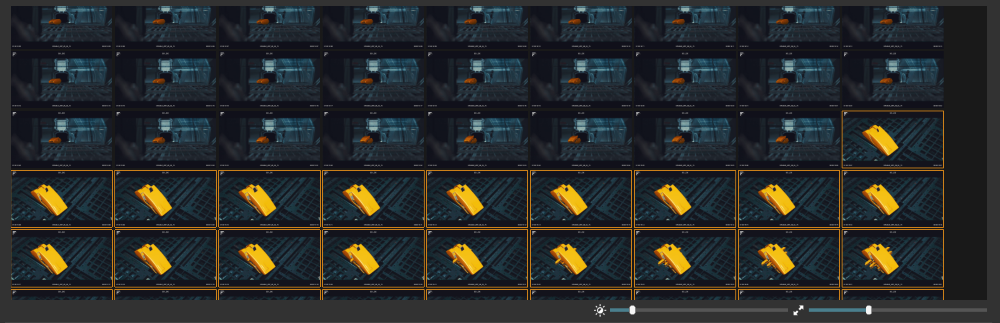

# Contact Sheet

When pressing the "Find Missing Cuts" button, the UI switches to [Contact Sheet Mode](modes.md) mode.

In this mode all frames of the currently selected shot are shown, so that it is easy to quickly spot a cut that was missed
by the auto-detection.  
To add a cut, simply click on the frame that should be the first frame of a new shot and hit ++c++.

The graph view is now zoomed in to only draw spikes for the current shot. This helps to quicly find missed cuts within the shot bound.

A small graph map is shown above the main [Spike Graph](spike_graph.md) to provide an overview where the current shot is located within the globla frame range. 

---

:fontawesome-solid-sliders:
The sliders under the contact sheet view allow for adjusting the brightness and size of the displayed frames.

---

!!! tip "Use hotkeys to change the selected shot and thus the displayed frame set:"

    ++page-up++ and ++page-down++ to move the shot selection in the table up or down

!!! tip "In [Contact Sheet Mode](modes.md) the arrow keys drive the selected frame (orange outline)" 

    ++up++ and ++down++ select the frame aboe or below the current selection

    ++left++ and ++right++ select the previoud/next frame

!!! info "Use ++grave++ to toggle between graph and [Contact Sheet Mode](modes.md)."
