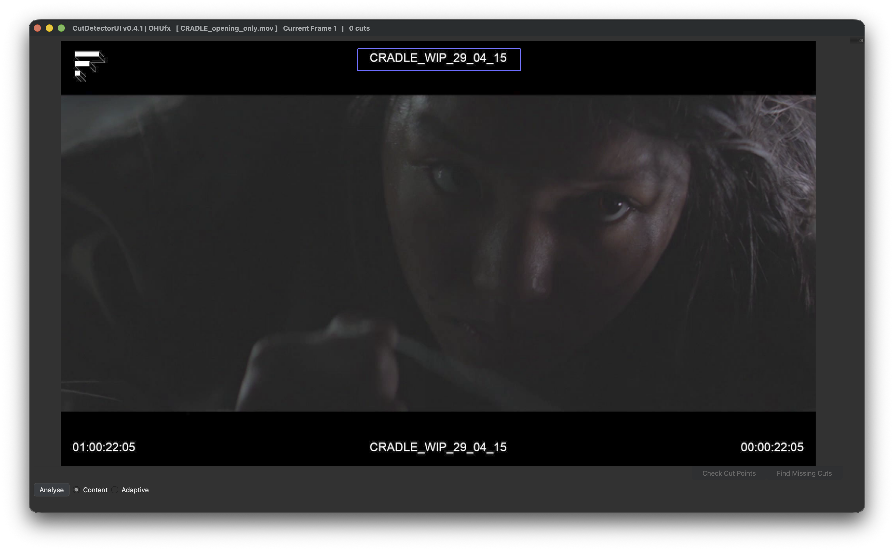
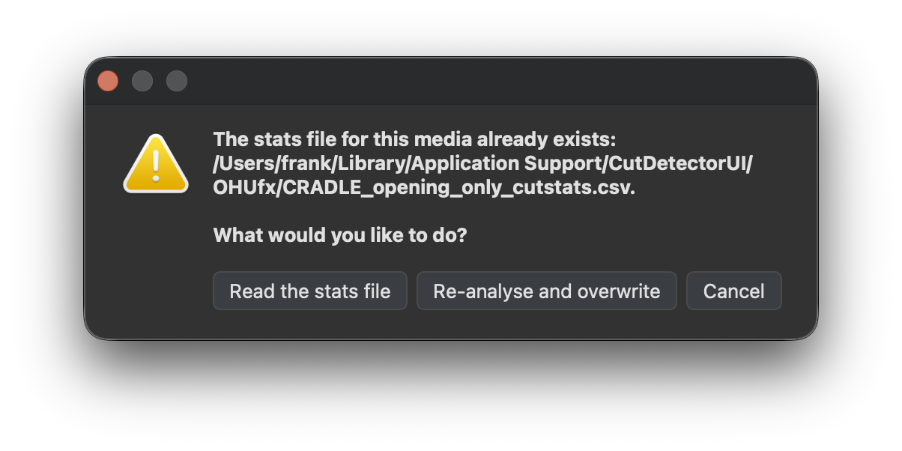

# Detecting Cuts

## First time analysis

{width=300px  align=right }

To analyse the clip do one of the following:
 
* Click the "Analyse" button in the lower left corner
* Press "Enter"

 
 

??? tip "The analysis can be constraint to a specific region"

    If the clip has burn-ins that change for each shot, it may be smart to analyse the burn in instead of the entire clip for more accurate results

    If you only want to analyse a specific region of the clip, you can do so by holding ++ctrl++ (++cmd++ on mac) and dragging a rectanble across the region you wish to analyse.
    
    See the purple outline in the above image.
    
    Right click to delete the drawn region.

There are currently two options to analyse the clip:

-   :material-chart-timeline:{ .lg .middle } __Content__

    ---

    The content-aware scene detector detects jump cuts in the input video.
    This is typically what people think of as "cuts" between scenes in a movie - given two adjacent frames, do they belong to the same scene?
    The content-aware scene detector finds areas where the difference between two subsequent frames exceeds a given threshold value that is set.
    The threshold can be adjusted interactively once the detection is complete (see [Sike Graph](spike_graph.md))

    [:octicons-arrow-right-24: Details](https://www.scenedetect.com/api/#adaptive-content-detector:~:text=Content%2DAware%20Detector)

- :material-chart-timeline:{ .lg .middle } __Adaptive__

    ---

    The adaptive content detector compares the difference in content between adjacent frames similar to detect-content but instead using a rolling average of adjacent frame changes.
    This helps mitigate false detections where there is fast camera motion.

    [:octicons-arrow-right-24: Details](https://www.scenedetect.com/api/#adaptive-content-detector:~:text=content%20for%20details.-,Adaptive%20Content%20Detector,-The%20adaptive%20content)

## Re-use previous analysis
If the clip was previously analysed, the results are automatically saved in a CSV file and CutDetector will offer to just read those values:

??? info "The per-clip csv files are saved in different locations depending on the operating system:"
    * Windows: %APPDATA%\\CutDetector\\OHUfx (Roaming profile)
    * macOS: ~/Library/Application Support/CutDetector/OHUfx
    * Linux: ~/.local/share/CutDetector/OHUfx

    !!! note "The location of those csv files should not matter to the user during the regular workflow."

!!! info "Saving the project will include the csv data as well, so the *.cdui* project file is fully portable."

