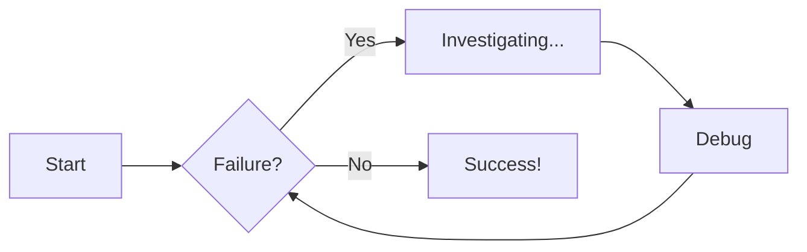
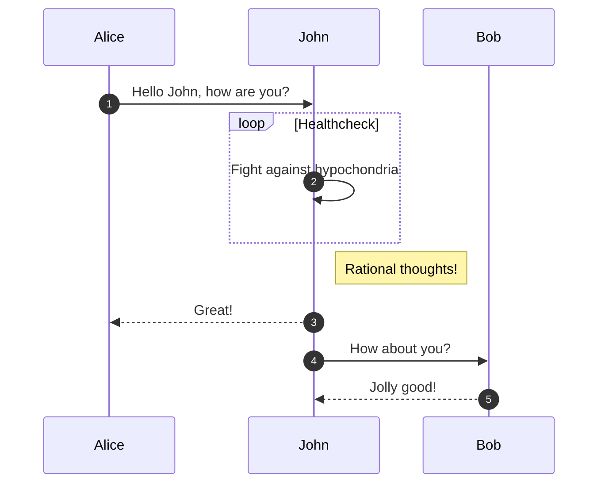

```mermaid
graph LR;
A[Start] --> B{Failure?};
B -->|Yes| C[Investigating...];
C --> D[Debug];
D --> B;
B -->|No| E[Success!];
```

``` mermaid
sequenceDiagram
  autonumber
  Alice->>John: Hello John, how are you?
  loop Healthcheck
      John->>John: Fight against hypochondria
  end
  Note right of John: Rational thoughts!
  John-->>Alice: Great!
  John->>Bob: How about you?
  Bob-->>John: Jolly good!
```