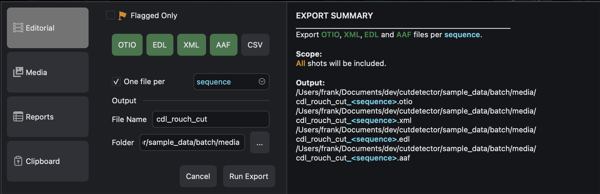

# Exporting
{ width=500px }

To export the cut data as presented in the [Shots Table](shots_table.md),
either use Quick Export or the Export Manager for more control

There are four categories and the respective output formats (as of June 2026):

- [x] Editorial Data...  
...to be imported into editorial applications:

- [x] otio
- [x] edl
- [x] aaf
- [x] xml
- [x] csv

---

- [x] Reports...  
...for human eyes and brains:
    * [x] :fontawesome-solid-file-pdf: PDF
    * [x] :material-microsoft-excel: XLS

---

- [x] Media...  
...always handy in this job
    * [x] :octicons-video-24: .mp4 (for sub clips per shot)
    * [x] :material-file-jpg-box: .jpg (thor thumbnails)

---

- [x] :material-clipboard: Clipboard...  
Put data into the clipboard for efficient workflows.  
Currently the only option it data to be pasted into `Autodesk Flow Production Tracking` (aka `ShotGrid`) to create new shots.

!!! note "Please join us on Discord  [:fontawesome-brands-discord:](https://discord.gg/puzJUaQdxD) to request any other options!"