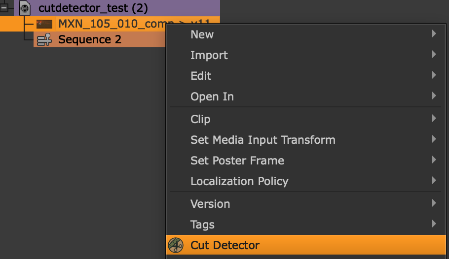
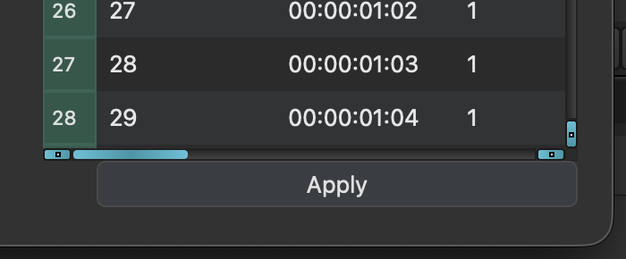
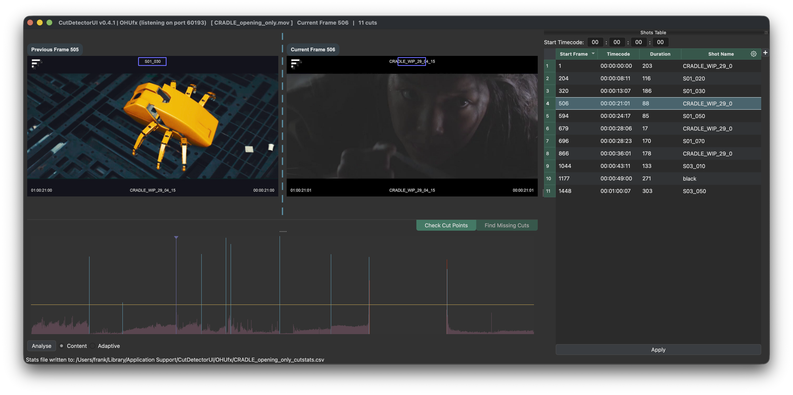
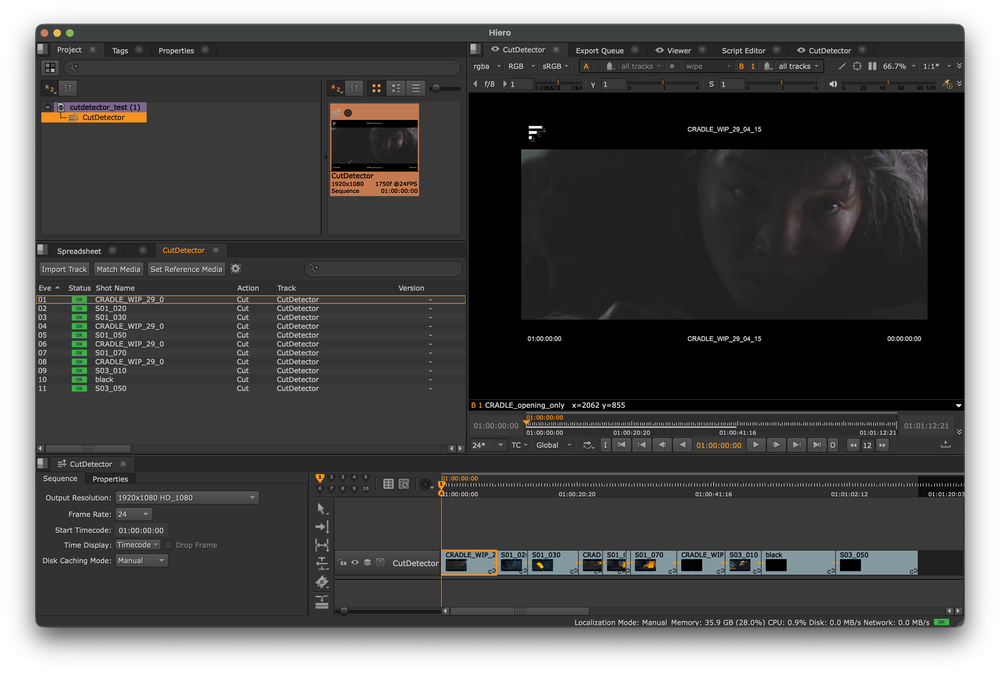

# Hiero

The Hiero integrations is done via a simple [IPC](https://en.wikipedia.org/wiki/Inter-process_communication){ target=_blank rel="noopener noreferrer" } approach.  
When launching CutDetectorPro from inside of Hiero, a communication channel is established between the two processes to send data back to Hiero.

The data that Hiero receives from CutDetectorPro is managed in the Hiero specific plugin that ships with CutDetectorPro.

To make sure Hiero can find CutDetectorPro, use one of the below methods:
???+ abstract "Default Plugin Folder"
    Create a file in this location:
    
    `$HOME/.nuke/Python/StartupUI/load_cutdetector.py`
    
    Paste the below into it and save it.
    ```python
    import hiero.core
    # update the below with the valid path to CutDetectorPro's location 
    hiero.core.addPluginPath("/path/to/CutDetectorPro/plugins/hiero")
    ```

??? abstract "Environment Variable"

    Set the `HIERO_PLUGIN_PATH` environment variable to the location of CutDetectorPro's plugins folder.
    ```bash
    export HIERO_PLUGIN_PATH=/path/to/CutDetectorPro/plugins/hiero
    
    !!! warning "If you are already using HIERO_PLUGIN_PATH, you probably want to append to its value instead of overwriting it"

Once either of the above is set up correctly, open Hiero and you should see CutDetectorPro in the context menu for bin items:

{width=500px}

When CutDetectorPro is launched this way, an additional `Apply` button will appear under the [Shots Table](shots_table.md).  
{width=500px}

This button will send the cut data back to Hiero:
{width=500px}

Where the bundled plugin turns it into a Sequence with soft cuts:
{width=500px}

*[IPC]: Inter Process Communication
