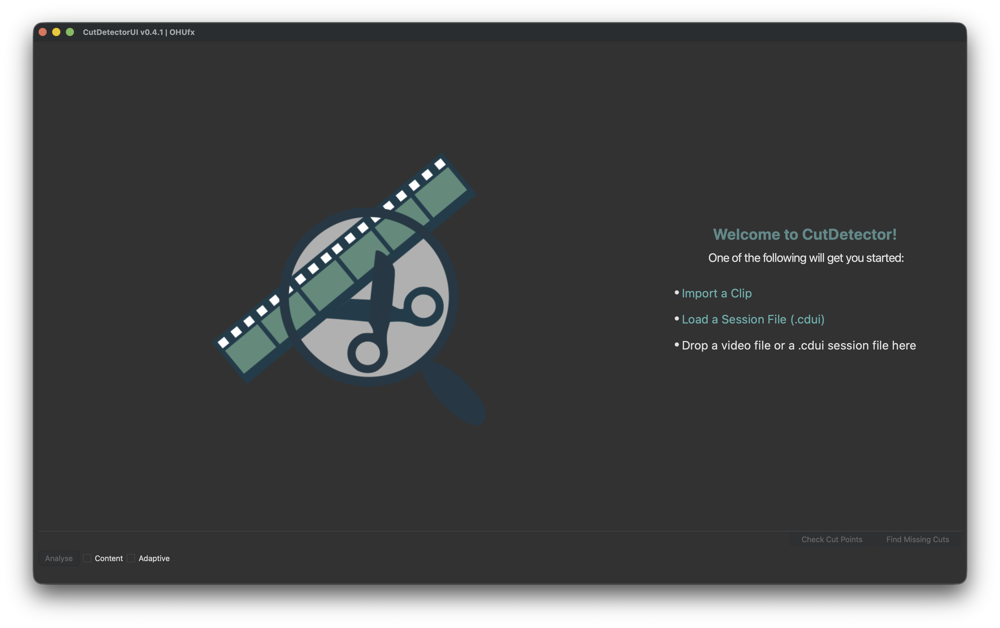

# Importing
{width=400px  align=right }

## Import a Clip
To import a clip:

* Drag & drop into a compatible video clip into an empty session
* Click "Import a Clip" on the landing page
* Choose "File/Import Clip..." from the menu
* Press ++ctrl+i++ (++cmd+i++ on mac)

## Load a session file (*.cdui)
To load a *.cdui* session file:

* Drag & drop into a previously saved .cdio file into an empty session
* Click "Load a Session File" on the landing page
* Choose "File/Load Session..." from the menu
* Press ctrl+o (++cmd+o++ on mac)