---
hide:
  - navigation

body_class: landing-page
---

<figure markdown="span">
  { width="200" }
  <figcaption></figcaption>
</figure>

# Welcome to Cut Detector (beta)
<h2 style="text-align: center;">Making cut detection intuitive & fun</h2>

---

<h4 style="text-align: center;">
A standalone app for automatic cut detection and much more, 
powered by Brandon Castellano’s <a href="https://www.scenedetect.com">PySceneDetect</a>.
</h4>

<figure markdown="span">
  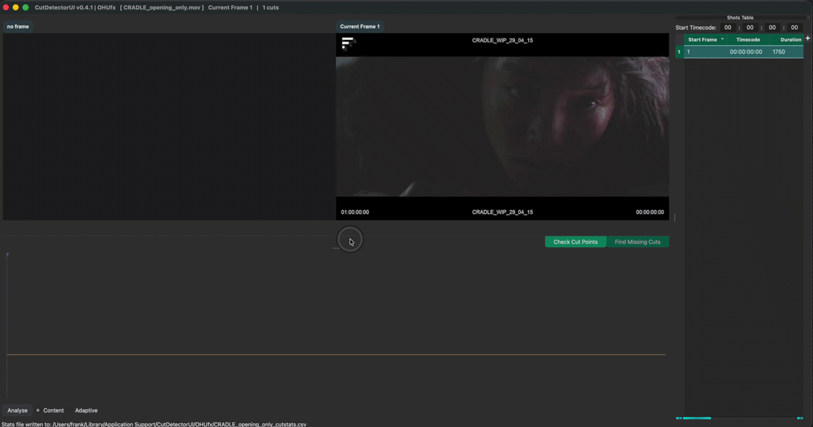{ width="600"}
  <figcaption></figcaption>
</figure>

---

CutDetector automates one of the most time-consuming parts of VFX shot preparation.

Automatically detect cuts with high accuracy, then interactively review and refine the results to ensure every edit is correct before moving on. Whether you're working with offline references edits or vfx string-outs during bidding, you stay in complete control of the final cut list.

Extract metadata directly from video burn-ins using OCR, including shot names, source timecodes, frame numbers, version information, VFX notes, and any other on-screen text.  Smart text processing tools let you clean, reformat, and transform the extracted data so it integrates seamlessly with your studio's pipeline and naming conventions.

Once your sequence is ready, export exactly what your workflow requires. Generate thumbnails for quick visual reference, create sub-clips for every shot, and export editorial data in multiple formats to kick-start your VFX pipeline with clean, production-ready assets.

From client turnover to interal shot preparation, CutDetector helps eliminate repetitive manual work, reduces human error, and gets artists working on shots faster.

---

[:fontawesome-brands-dropbox: Download the Beta](https://www.dropbox.com/scl/fo/5v9ekfemn8emglbqad464/AJE6tCLfrTumMXe8mzH65ak?rlkey=sjm60bjkltwsuzqkssxa06yc5&st=4hqtsdg7&dl=0){ .md-button .fixed-width-button }

[:fontawesome-brands-discord: Join Us on Discord](https://discord.gg/puzJUaQdxD){ .md-button .fixed-width-button }

 

- :octicons-desktop-download-16:{ .lg .middle }
    [:octicons-arrow-right-24: Installation](installation.md)

- :octicons-log-24:{ .lg .middle }
    [:octicons-arrow-right-24: Release Notes](release_notes.md)

- :material-rocket-launch:{ .lg .middle }
    [:octicons-arrow-right-24: Get Started](quick_start.md)

???+ feature ":material-content-cut: Automatic Cut Detection"
    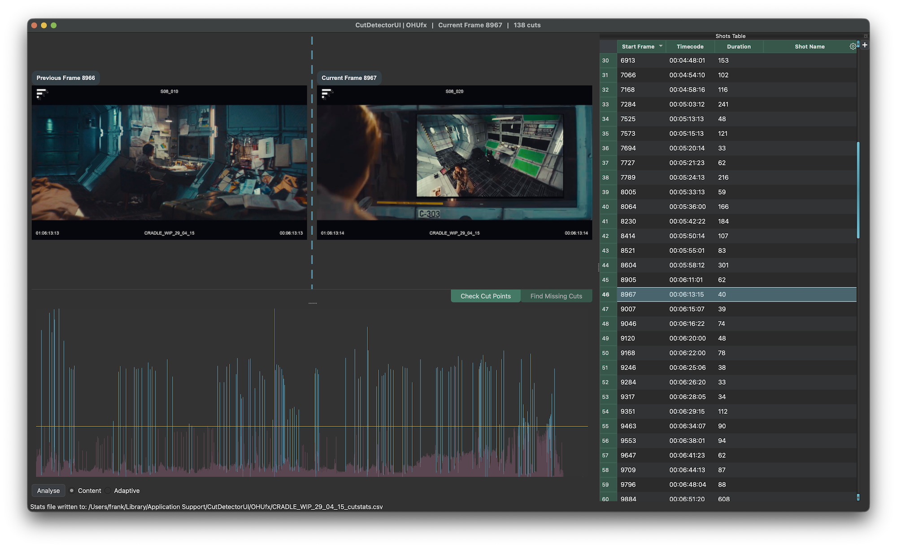{width=600px align=left}

    Stop wasting time by manually cutting up reference clips!

    CutDetector automatically detects cuts in a video clip and visualises them in a [Spike Graph](spike_graph.md).

    Drag a box around a region to limit the cut detection to a specific area (e.g. a burn-in).
    
    Quickly verify the detection results with the dual viewer UI.

??? feature ":material-calculator: Realtime Shot Extraction"
    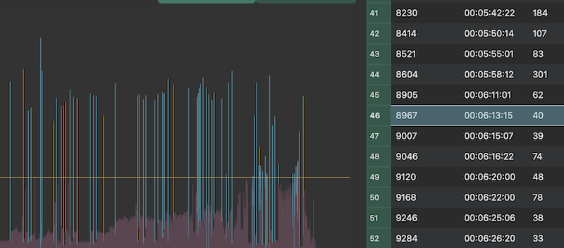{width=600px align=right}

    The analysis data is automatically saved so that each clip only has to be analysed once (**even between sessions**).

    The threshold line can be moved to define which of the spikes signify an actual cut and produce an entry in the shots table.

??? feature ":material-steering: Stay in Control"
    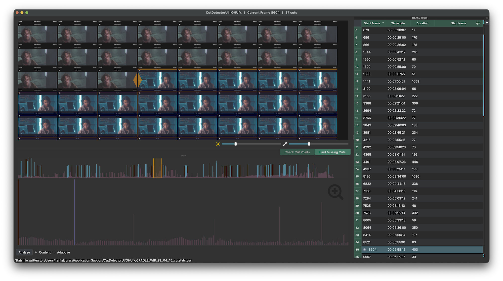{width=600px align=left}
    
    Clean up the auto-detection with intuitive tools that give you full control.

    False positives can simply be selected in the [Shots Table](shots_table.md) and deleted.

    Missing cuts can easily identified and added via the [ContactSheet View](contact_sheet.md)

    Manual edits are visualised in the [Graph View](spike_graph.md) and saved in the session even when the threshold changes later.

??? feature ":fontawesome-solid-paint-brush: Interact with the Data"
    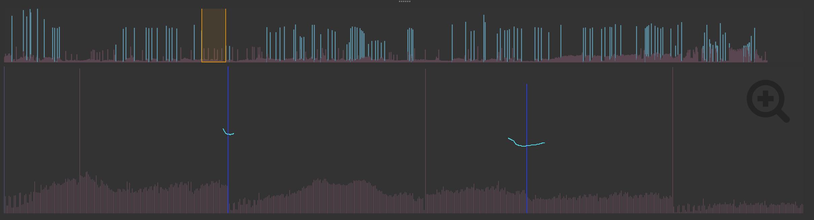{width=600px align=right}
    
    Don't just look at the analysis result, interact with it!

    Data spikes can be selected with paint strokes to add them as a manual edit (or to delete false positives).

??? feature ":material-format-text: Text Extraction"
    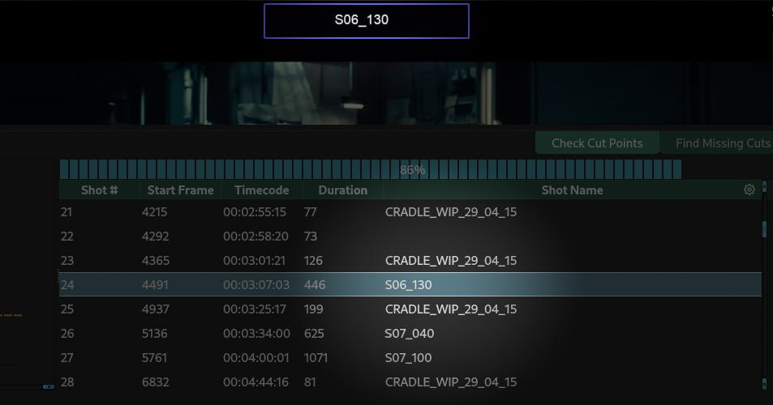{width=600px align=left}
    
    Grab editable text directly from the video burn-ins!    

    CutDetector uses [Tesseract](installation.md#tesseract) to extract text from images.
    
    Want to extract text from a burno-in like shot IDs, vfx notes, source timecodes etc? 

    Simply drag a rectangle to define the area you want extract text from and send the result to a column of your choice in the [Shots Table](shots_table.md).

??? feature ":material-factory: Prepare the Data You Need"
    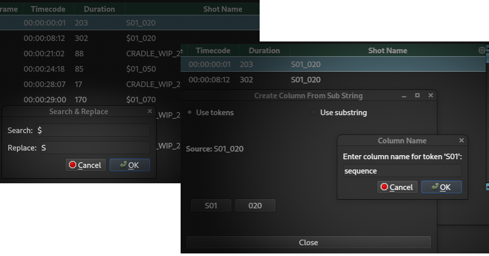{width=600px align=right}
    
    Full control for 100% results.
    
    Extracted data can be edited in the [Shots Table](shots_table.md) via **search&replace**, new columns can be added to hold more text.
    
    Text parse an existing column to create a new one, e.g.  
    make a sequence column **"010"** from a shot column holding data like **"010_0020"**.

??? feature ":fontawesome-regular-bar-chart: Export editorial data"
    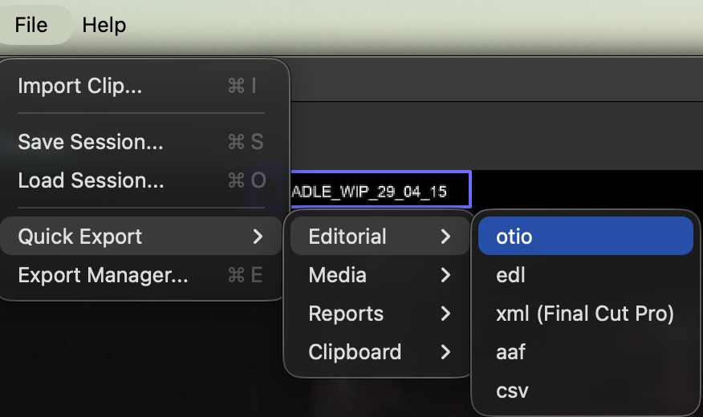{width=600px align=left}
    
    Export to the most common editorial formats:

    - otio
    - edl
    - xml
    - aaf
    - csv

??? feature ":material-microsoft-excel::material-file-pdf-box: Export Reports"
    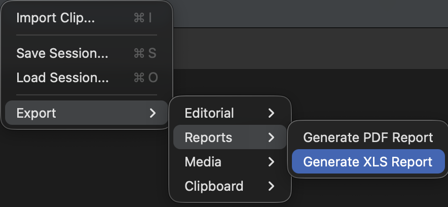{width=600px align=right}

    Export **pdf** or **xls** reports with thumbnails.

??? feature ":octicons-file-media-24: :octicons-video-24: Export media"
    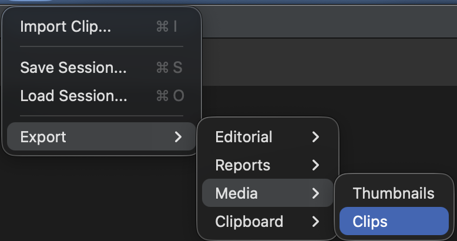{width=600px align=left}
    
    Export subclips (**mp4**) and thumbnails (1024px wide **jpg**)
    ??? note "[ffmpeg](installation.md#ffmpeg) is required for exporting clips"

??? feature ":material-clipboard: Export To Clipboard"
    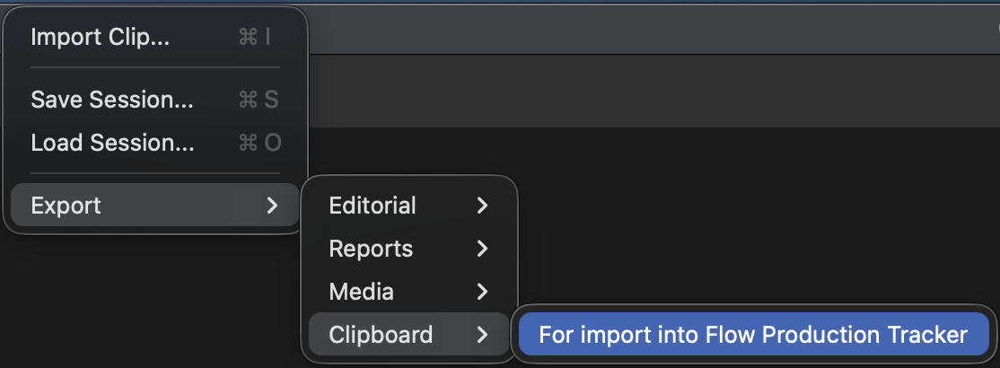{width=600px align=right}

    For easy integration with Autodesk's [Flow Production Tracking (aka ShotGrid)](https://www.autodesk.com/products/flow-production-tracking){target=_blank}

??? feature ":material-power-plug-outline: Integration with Foundry's Hiero"
    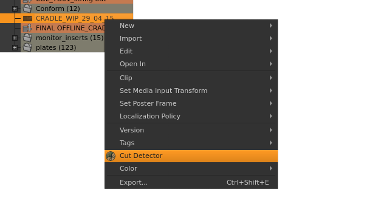{width=600px align=left}
    
    Using Hiero?  
    Run CutDetector on a selected bin item and create a sequence on the fly without the need for exporting/importing.
