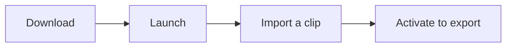

# Install & Activate

Getting from download to your first cut list takes a few minutes.
CutDetectorPro is a standalone app for **macOS, Windows and Linux**, so there's no installer to run.



## 1. Download and launch

Download CutDetectorPro from the [beta download folder](https://www.dropbox.com/scl/fo/5v9ekfemn8emglbqad464/AJE6tCLfrTumMXe8mzH65ak?rlkey=sjm60bjkltwsuzqkssxa06yc5&st=4hqtsdg7&dl=0){ target=_blank rel="noopener noreferrer" }
and unpack it wherever you like. It runs right where it is, so there's nothing to install.

!!! warning "macOS: “the app bundle is corrupt” warning"

    On macOS you may see a warning about a corrupt app bundle the first time you open the app. This is macOS being cautious about an app that isn't yet notarised by Apple.
    This video shows how to get past it:

    <figure>
      <iframe
        loading="lazy"
        src="https://www.youtube.com/embed/MEHFd0PCQh4"
        title="How to open the app on macOS"
        allowfullscreen>
      </iframe>
    </figure>

    Once CutDetectorPro is out of beta I'll pay for Apple's certification, and this warning will go away.

## 2. Activate your license

You can try CutDetectorPro straight away. Without a license key it runs in **demo mode**: you can import clips, detect and fix cuts and extract text,
but the **export features are switched off** (and so is the `Apply` button of the [Hiero integration](hiero_integration.md)).
An orange **UNLICENSED** bar in the status bar reminds you.

To unlock everything, activate a license key. The beta license is free, so join our [Discord](https://discord.gg/puzJUaQdxD) to get yours.

1. Click the orange **UNLICENSED** bar, or choose **Help → Activate License...**
2. Enter your license key in the **Activate CutDetectorPro** dialog and confirm.
3. That's it. The key is now tied to this machine, and the exports are enabled.

<!-- MEDIA (activation): a 10 s screen recording or two screenshots: the Activate dialog, and the success dialog. -->

??? question "Moving to a different computer?"

    Choose **Help → Deactivate License...** on the old machine to free up the activation, then activate on the new one.

??? question "Does it need an internet connection?"

    Only occasionally. CutDetectorPro re-checks your license online about once a week.
    If you're offline when that happens, it keeps working for up to **14 days** and shows you how many are left.

## 3. Tesseract and ffmpeg

Two features rely on free third-party tools. **Both come with CutDetectorPro on most systems**, so you normally don't have to install anything:

| Tool | Used for | Included with the app on |
|------|----------|--------------------------|
| Tesseract (English) | [Text extraction (OCR)](ocr.md) from burn-ins | macOS (Apple Silicon, macOS 15 or later), Windows (64-bit), Linux (x86_64) |
| ffmpeg | Exporting mp4 [sub-clips](exporting.md) per shot | macOS (Apple Silicon and Intel), Windows (64-bit), Linux (x86_64 and ARM) |

On any other system, [install Tesseract](#tesseract-text-extraction) and/or [ffmpeg](#ffmpeg-clip-export) yourself.
Without them, everything else still works: text extraction is unavailable and the clip export options are greyed out.

### Which copy does the app use?

CutDetectorPro looks for each tool in this order, and uses the first one it finds:

1. The path in the environment variable `CDUI_TESSERACT_PATH` or `CDUI_FFMPEG_PATH`
2. The path you set in **Preferences**
3. The copy that ships with the app
4. One installed on your system (on your `PATH`, or in the usual install folders)

So if you'd rather use your own build, point **Preferences** at it and it takes priority over the bundled one.
To see exactly which one is in use, open **Help → About CutDetectorPro → Environment**. It shows the path, how it was found and its version.

<!-- MEDIA (about dialog): screenshot of Help > About CutDetectorPro > Environment tab, and of the Preferences dialog with the two paths. -->

### Tesseract (text extraction)

[Tesseract](https://tesseract-ocr.github.io/tessdoc/Installation.html){ target=_blank rel="noopener noreferrer" } is an open-source tool that reads text from images.
You only need to install it yourself on systems where it isn't [included](#3-tesseract-and-ffmpeg), or to use your own copy.

=== ":fontawesome-brands-windows: Windows"

    1. Download the installer from the [UB Mannheim builds](https://github.com/UB-Mannheim/tesseract/wiki){ target=_blank rel="noopener noreferrer" }, the most widely used Windows distribution.
    2. Run it. The default install location is fine.
    3. Make sure **Add to PATH** is ticked.
    4. Check it worked by opening a Command Prompt and running:

    ```
    tesseract --version
    ```

=== ":fontawesome-brands-apple: macOS"

    The easiest way is [Homebrew](https://brew.sh){ target=_blank rel="noopener noreferrer" }:

    ```bash
    brew install tesseract
    tesseract --version
    ```

=== ":simple-linux: Linux"

    ```bash
    # Debian / Ubuntu
    sudo apt update
    sudo apt install tesseract-ocr

    # Fedora / RHEL
    sudo dnf install tesseract

    tesseract --version
    ```

??? info "Which languages can it read?"

    Text extraction reads **English**. The Tesseract that ships with the app contains English language data only.

### ffmpeg (clip export)

[ffmpeg](https://ffmpeg.org/download.html){ target=_blank rel="noopener noreferrer" } is the standard tool for converting and cutting video.
CutDetectorPro uses it to write one mp4 sub-clip per shot.
You only need to install it yourself on systems where it isn't [included](#3-tesseract-and-ffmpeg), or to use your own copy.

=== ":fontawesome-brands-windows: Windows"

    ```
    winget install Gyan.FFmpeg
    ffmpeg -version
    ```

    Prefer a manual install? Download a build from the [ffmpeg download page](https://ffmpeg.org/download.html#build-windows){ target=_blank rel="noopener noreferrer" }
    and add its `bin` folder to your `PATH`.

=== ":fontawesome-brands-apple: macOS"

    ```bash
    brew install ffmpeg
    ffmpeg -version
    ```

=== ":simple-linux: Linux"

    ```bash
    # Debian / Ubuntu
    sudo apt update
    sudo apt install ffmpeg

    ffmpeg -version
    ```

    On Fedora and RHEL, ffmpeg is available through [RPM Fusion](https://rpmfusion.org/Configuration){ target=_blank rel="noopener noreferrer" }.

## What's next?

<div class="grid cards" markdown>

- :material-rocket-launch:{ .lg .middle } **Quick Start**

    Import a clip and get your first cut list in five minutes.

    [:octicons-arrow-right-24: Quick start](quick_start.md)

- :material-history:{ .lg .middle } **What's new**

    See what changed in the latest version.

    [:octicons-arrow-right-24: Release notes](release_notes.md)

</div>
