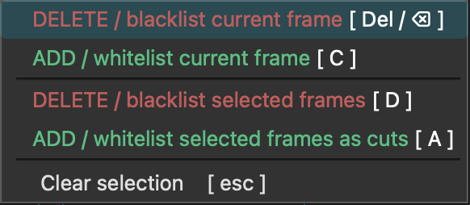

# Manual Edits

Hotkeys for manual editing:

| Method                   | Description                                                    |
|--------------------------|----------------------------------------------------------------|
| ++alt++ + `click&drag`   | :material-selection:       Paint-select spikes in the graph    |
| ++a++                    | :material-plus-circle:     Add/whitelist selected spikes       |
| ++c++                    | :material-plus-circle:        Add/whitelist the current frame  |
| ++d++                    | :material-delete-circle:   Delete/blacklist selected spikes    |
| ++delete++/++backspace++ | :material-delete-circle:   Delete/blacklist the current frame  |

There is also a context menu in the graph view:
{width=300px}

!!! info "For more info on how to add and remove cut points (aka whitelist and blacklist frames),  see [Contact Sheet](contact_sheet.md) and [Spike Graph](spike_graph.md)."
