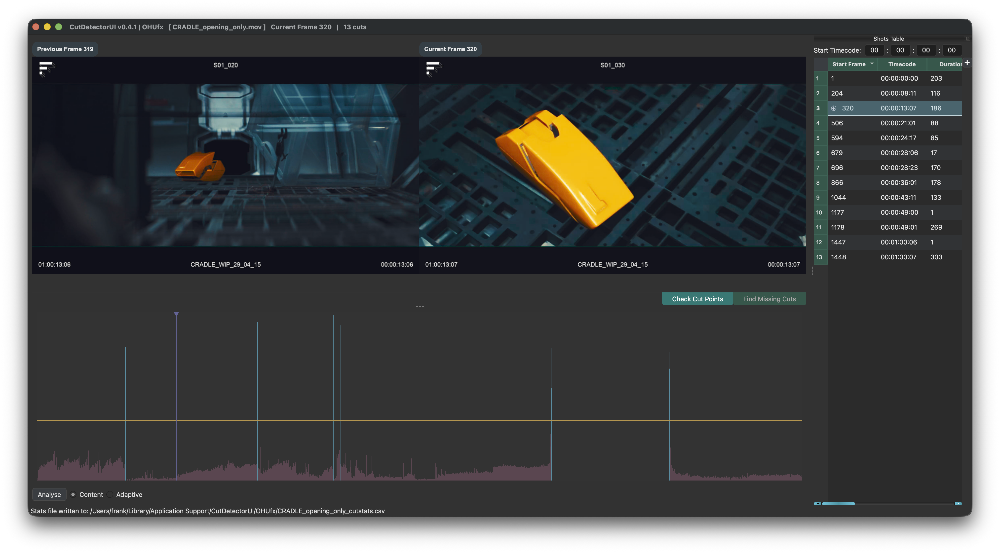
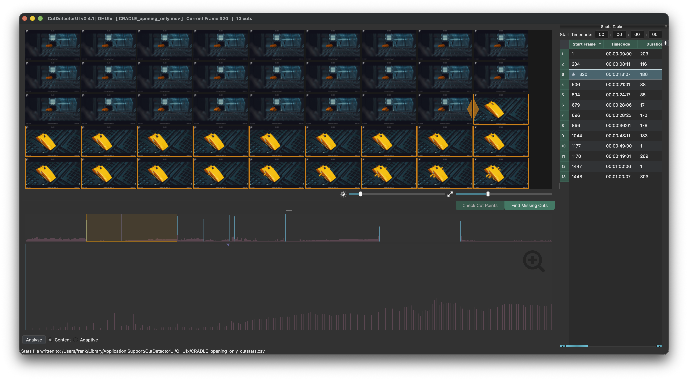

# Modes

## Preview Mode

The Preview Mode is best suited for verifying the currently defined cuts.
The preview window on the right represents the current frame, which is to say the frame under the playhead in the [Spike Graph](spike_graph.md)
The frame number is recorded in the [Shots Table](shots_table.md) in the "Dtart Frame" column.

Use ++page-up++ and ++page-down++ to navigate through all cuts and check that the left and right preview windows show frames of different shots.

If not the cut is a false positive and hitting ++delete++ or ++backspace++ will remove and blacklist it. See [Manual Edits](manual_edits.md) for details.

## Contact Sheet Mode

The Contact Sheet Mode is best suited for finding cuts that were missed by the cut detection.

All frames of the current shot are displayed, so it is easy to spot missed cuts.
Use the arrow keys (or the mouse) to select the first frame of a missed cut and hit ++c++ to add/whitelist it.

See [Contact Sheet](contact_sheet.md) for details.

