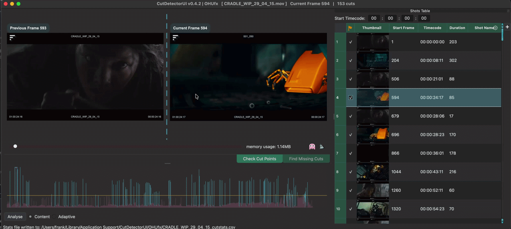

# Overlay Player

## Play back the current shot
The simple overlay player plays back the currently selected shot in the [Shots Table](shots_table.md) using the source media's fps.

Playback will cache the frames using the [Global Frame Cache](frame_cache.md)

If the frames are not cached when the player is opened, playback may be slower than expected, but after one run through playback should be smooth.

### Controlling the player

- ++space++: Open the player

- ++right++: Step forward by one frame

- ++left++: Step backward by one frame

- ++up++: Jump to first frame

- ++down++: Jump to last frame

- ++escape++: Close player