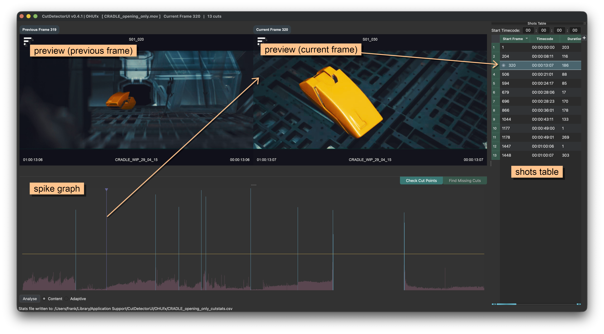
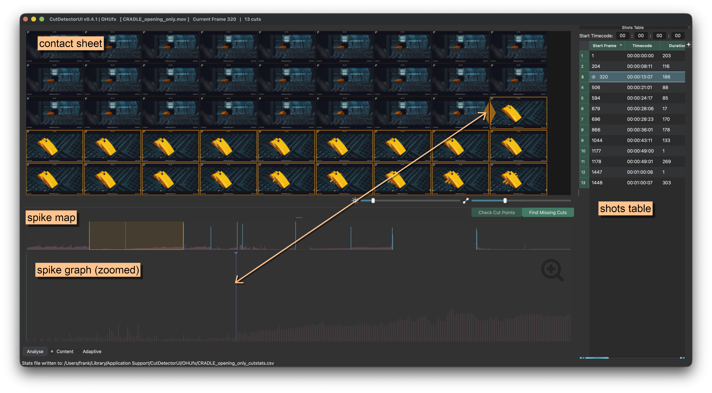
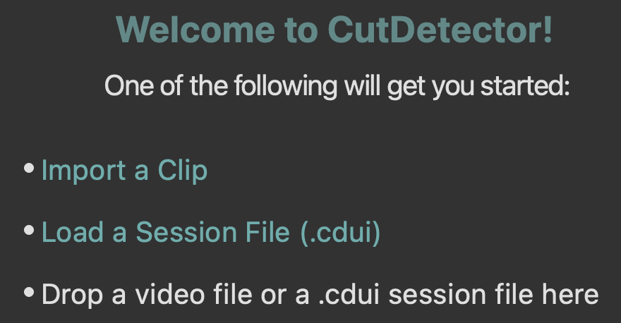
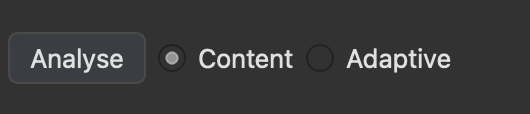
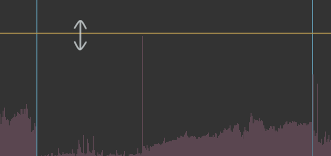
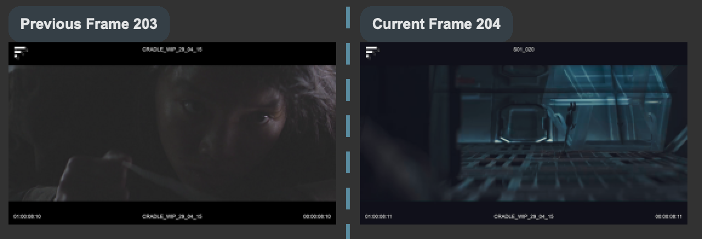
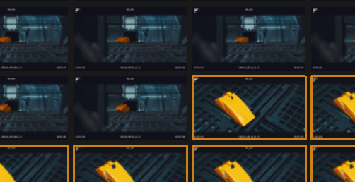
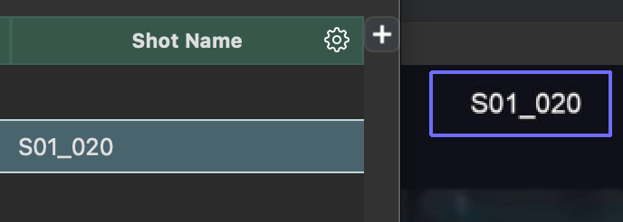
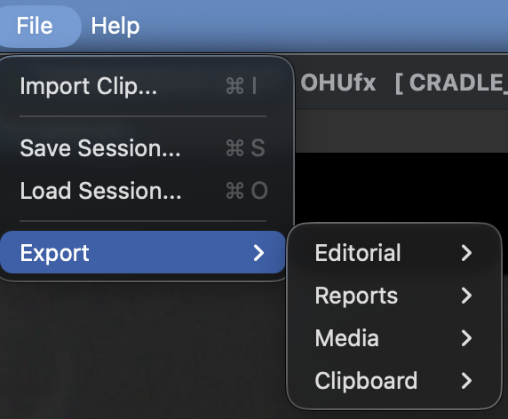

---
hide:
  - navigation
---

# Quick Start

???+ task "UI Overview"
        
    

    
    

    
    ## Preview Mode
    
    This mode is best for validating the current cut points in the [Shots Table](shots_table.md).
    
    Simply jump between cut points with ++page-up++ and ++page-down++. Verify that the left preview (previous frame) shows a different shot than the right preview (current frame).
    
    

    
    

    
    {width=400px}
    
    

    
    

    
    ## Contact Sheet Mode
    
    Contact Sheet Mode is best for finding missing cuts by scrolling through the frames of the current shot.
    
    Select the first frame of a new shot and press ++c++ to create a cut at that point.
    
    

    
    

    
    {width=400px}
    
    

    
    

    
    These are the preferred methods for editing analysis results because the user can see exactly where cuts occur.
    
    Spikes can also be selected and added or removed, but in that workflow the corresponding frames are not visible.

    For more details see [Spike Graph](spike_graph.md).

??? task "1. Import a clip"
    {align=right width=30%}
    Click the `Import a Clip` hyperlink on the landing page and locate the clip you want to analyse.  
    See  for more details. 

??? task "2. Detect Cuts"
    {align=right width=30%}
    In the lower left corner of the page, click the `Analyse` button (or simply hit ++enter++).  
    See  for more details.

??? task "3. Adjust Threshold"
    {align=right width=30%}
    In the [Spike Graph](spike_graph.md) adjust the threshold - any spike that crosses it  
    will be identified as a cut point and added to the [Shots Table](shots_table.md)

??? task "4. Verify Cut Points"
    {align=right width=30%}
    Use ++page-up++ and ++page-down++ to jump between the cut points listed in the table  
    and ensure the left and right preview windows are showing frames from different shot.  
    If a cut point is incorrect, place the playhead on it (or select the corresponding table row) and press ++delete++ or ++backspace++.

??? task "5. Check Missing Cuts"
    {align=right width=30%}
    To check for missing cuts, switch to the [Contact Sheet](contact_sheet.md) mode to see all frames of the current shot     
    Adjust the thumbnail brightness and scale as neeeded.  
    If there is a missing cut in the current shot, click on the first frame of the new shot and hit ++c++ to cut.

??? task "6. Extract Text"
    {align=right width=30%}
    To extract text from the clip, hold ++ctrl++ (++cmd++ on macOS) and click drag a region over the part of the image that contains text.  
    In the [Shots Table](shots_table.md) click the gear icon to export the project.

??? task "7. Export"
    {align=right width=30%}
    To export the project, go to the `File`menu and choose the desired option.  
    See [Exporting](exporting.md) for more details.

