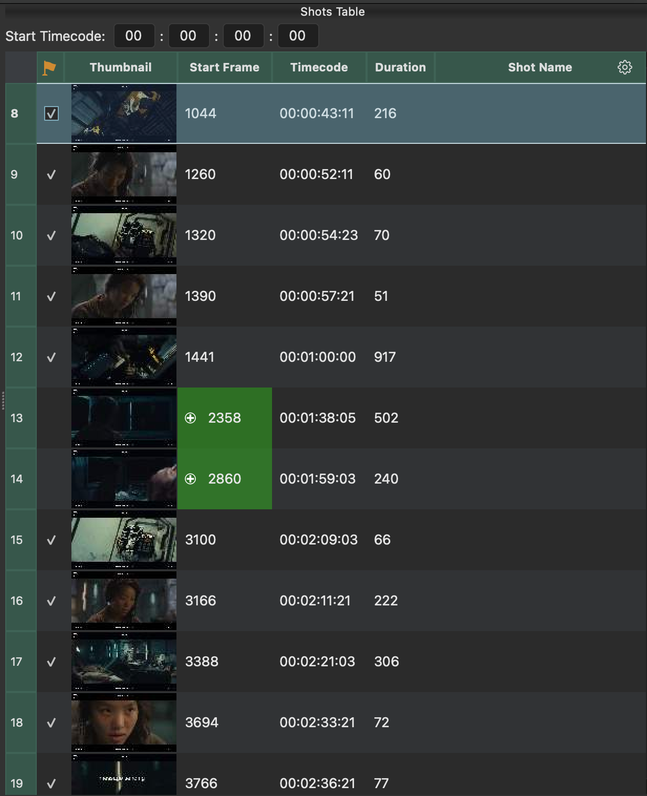
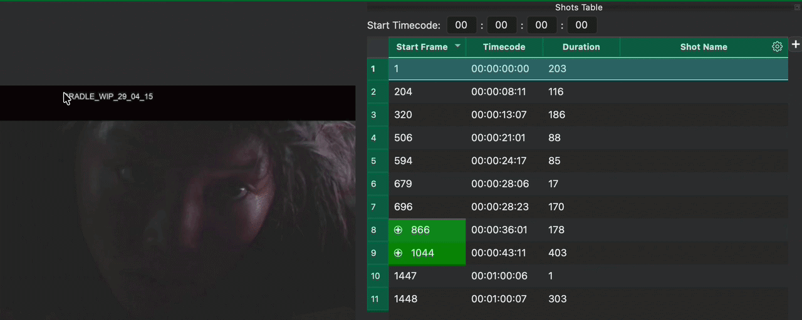
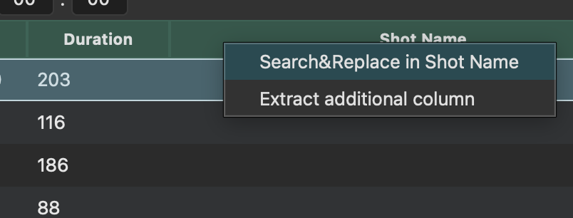
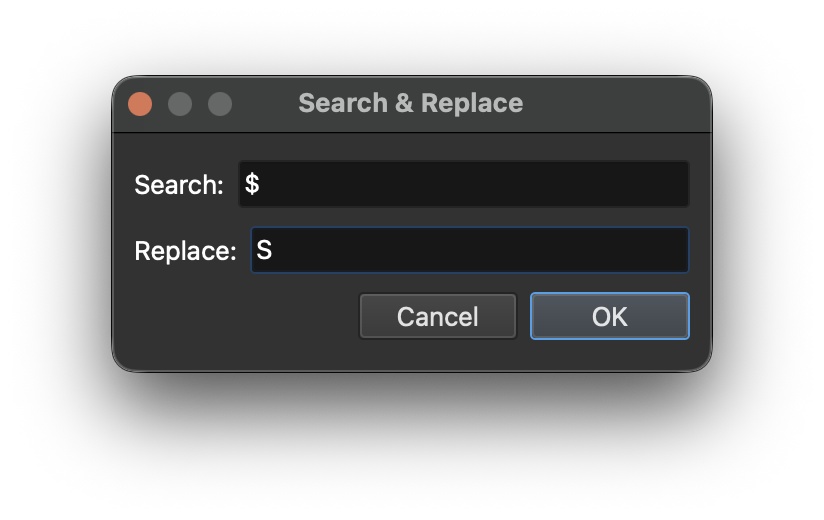
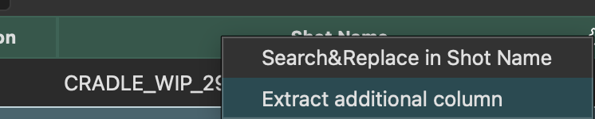
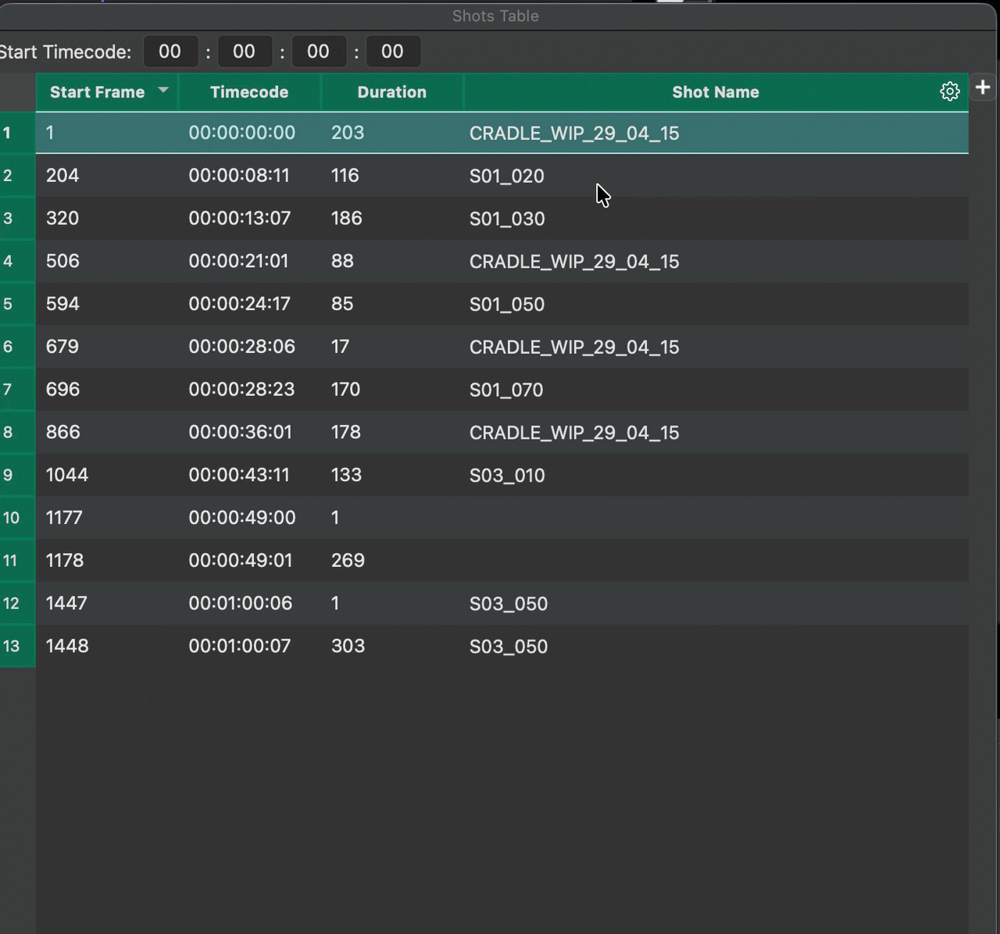
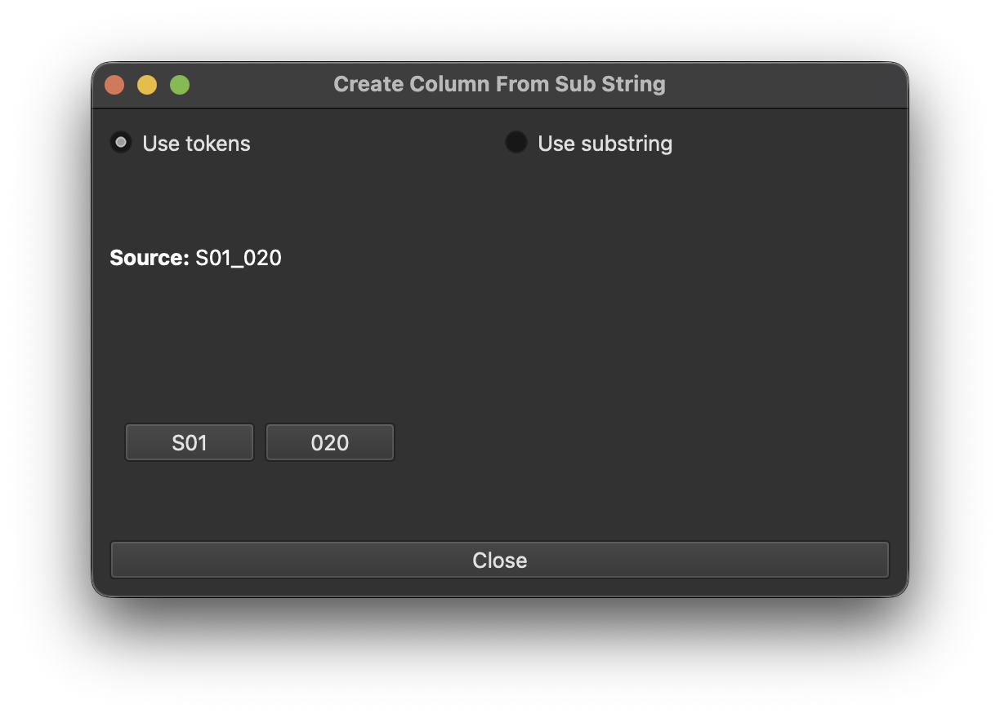
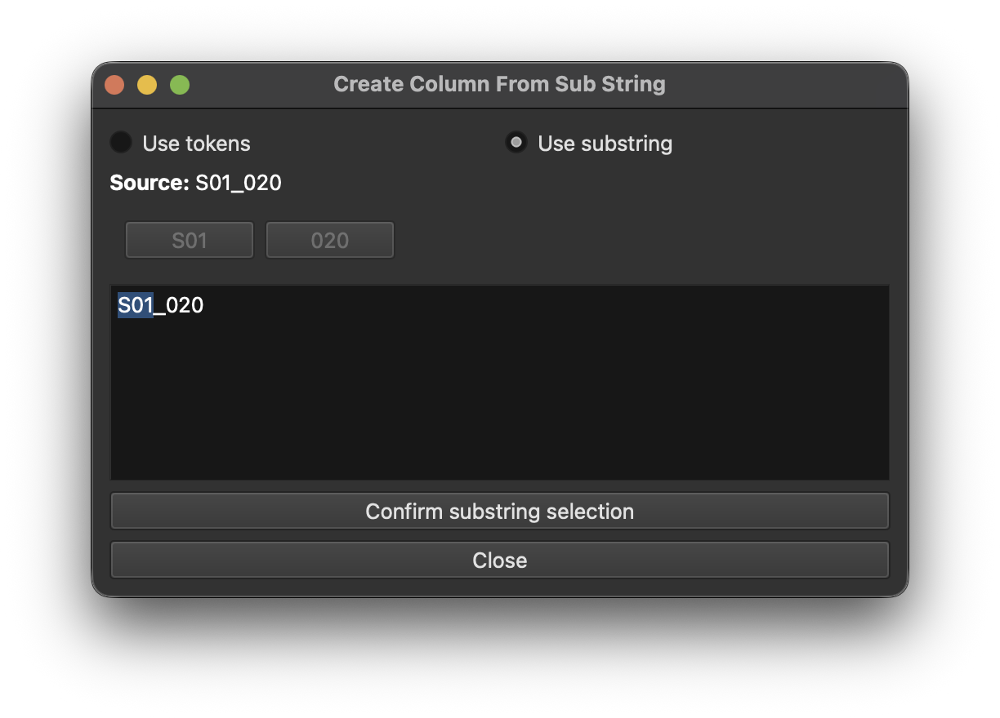

# Shots Table

{width=300px  align=right }

The Shots Table shows the data that will be exported.
Every row represents a spike in the [Spike Graph](spike_graph.md) that is above the threshold and not blacklisted.

To delete a shot (and blacklist the frame that was identified as a cut), simply select the row and hit ++delete++.
Blacklisted frames will not be considered as cuts anymore if the threshold changes.
Blacklisted frames will be drawn red in the [Spike Graph](spike_graph.md).

When shots are added (aka whitelisted), they are also added to the table regardless of the threshold.
See [Spike Graph](spike_graph.md) for details on how to add manual cuts and therefore whitelist the respective frames.

These manual cuts are highlighted in green with a :octicons-plus-circle-16: icon and drawn as green spikes in the [Spike Graph](spike_graph.md)

!!! tip "The Shots Table can be torn off from the main window and used as a floating panel"

## Default Data
The first three columns contain calculated data:

- Start Frame
- Timecode
- Duration (in frames)

!!! tip "The values of the Timecode column can be modified by specifying a start timecode above the table."

Subsequent columns can receive the results of the text recognition engine (tesseract). Such columns are marked with a :octicons-gear-24: icon.

## Adding custom columns
Using the :octicons-plus-16: button in the upper right corner of the table, you can add new columns with custom headers (e.g. "vfx notes")

Custom columns can be used to receive OCR data, or to store the result of parsing the values of another OCR column (e.g. to extract a sequence name from a shot name).

See [below for details](#text-parsing).

Custom column can be removed by right-clicking on their header.

## Text Extraction (OCR)
Each column that has a :octicons-gear-24: icon can receive the results of the text recognition engine (tesseract).

To run text recognition on a column, make sure you are in preview mode (click "Check Cut Points"), hold ++ctrl++ (++cmd++ on mac) and click & drag a rectangle around the area of the image that should be extracted (e.g. part of a burn-in)
Then click the :octicons-gear-24: icon of the column that should receive the resulting text.

## Text Parsing

### Search & Replace
The OCR results may not be perfect. For example, in the above screen recording, some zeros came through as a "$" sign.
To fix this, you can simply right-click on the column header and select "Search&Replace".

{width=600px}

{width=600px}

### Create New Column from Existing Column
If you want to create a new column that contains parts of the result of an existing column, you can right-click on the column header and select "Extract Additional Column".

E.g.: With values like "S01_010" in the "Shot Name" column, a "Sequence" column can be created that contains just "S01".

{width=600px}

!!! note "Select the row whos column value you want to see as a preview in the text extraction window."

#### Tokens
When using tokens to extract text from a column, the following delimiters are used to split the text:

 "_" (underscore), "." (period), "-" (hyphen), " " (space)

The parts of the text are represented as buttons in token mode: 

{width=600px}

Click the button that represents the text part to be used in the new column and a prompt will ask for the new column name as shown in the above recording.

#### Sub Strings
It is also possible to extract substrings using the discrete position of the letters in the text.
In this case switch to "Use Substring" and simply select the letters that are in the correct position:

{width=600px}

Clicking "Confirm substring selection" will prompt for the new column name.
