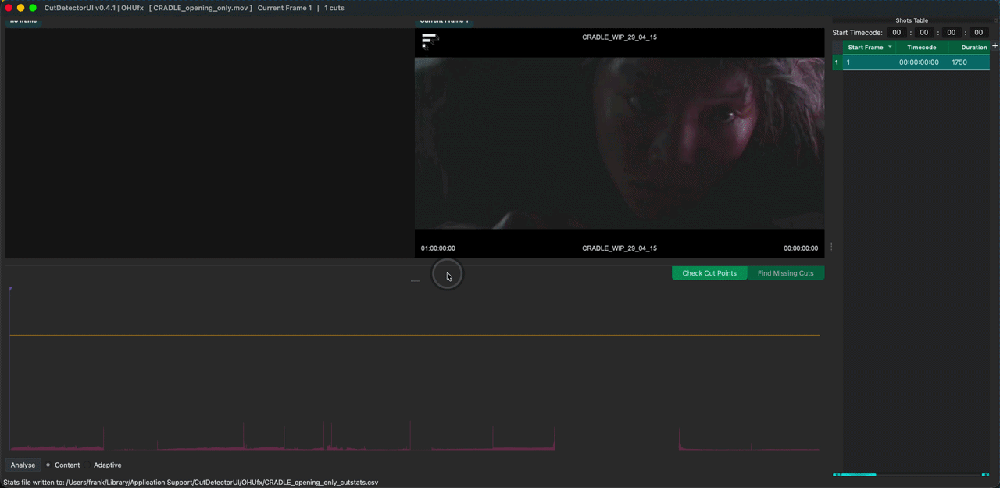
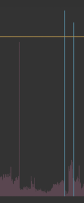
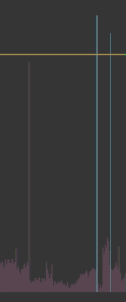

# Spike Graph

## Visualising the analysis data
Once the cut analysis is complete, the result is visualised as a spike graph where each frame in the clip is represented by a spike whos height 
represents the statistical difference to the previous frame.

Clicking into the graph will change the preview frames above the graph. The frame under the playhead is shown on the right, the previous frame on the left.

The selection in the [Shots Table](shots_table.md) is synced with the playhead position. The table will select the shot that the playhead is currently on.

!!! info "Use hotkeys to navigate frames and cut points:"

    ++left++ and ++right++ to move the playhead frame by frame ==this only works in *preview* mode==

    
    ++page-up++ and ++page-down++ to move the playhead frame by frame ==this works in both *graph* and *contact sheet* mode==

    ++up++ and ++down++ to jump between cut points (table rows)

    ++alt++ + `click&drag` to paint-select spikes for manual editing

This makes it easy to step through the current cut points and check their validity.

## Interacting with the data
The user can interact with the data in the following ways:

=== ":octicons-diff-24: Threshold"
    { align=left }

    The taller a spike, the bigger its statistical difference to the previous frame.

    The yellow threshold bar can be used to define which spikes will be interpreted as actual cut points (teal coloured).

    Spikes above the threshold will be listed in the [Shots Table](shots_table.md), as well as manually added cut points.

=== ":octicons-thumbsup-24: Adding Cuts"
    { align=left }

    For more control cut points can be added manually. Manually added cut points are whitelisted, so that subsequent threshold changed will have on effect on them.
    These edits will draw as bright green spikes.

    - Jump to the frame that should be a cut point by clicking on the respective spike (use arrow keys to navigate frame by frame),
        then press ++c++ (to `C` ut)
    - Holding ++alt++ and click+dragging the mouse over the spike(s) that should be interpreted as cut points and press ++a++ (to `A`dd a cut point)

=== ":octicons-thumbsdown-24: Removing Cuts"
    { align=left }

    False positives can be removed in the same way. Manually removed cut points are blacklisted, so that subsequent threshold changed will have on effect on them.
    These edits will draw as bright red spikes.

    - Jump to the frame that should never be a cut point by clicking on the respective frame (use ++page-up++/page-down++ keys to navigate cut by cut),
        then press ++delete++ or ++backspace++
    - Holding ++alt++ and click+dragging the mouse over the spike(s) that should be removed as cut points and press ++d++ (to `D` elete the cut point)

!!! tip "To find and add missing cut points, I recommend using the Contact Sheet view instead by clicking on ["Find Missing Cuts..."](contact_sheet.md) or pressing ++grave++"
